-------------------------------------------------------------------------------
CIS565: Project 2: CUDA Pathtracer
-------------------------------------------------------------------------------
Fall 2013
-------------------------------------------------------------------------------

-------------------------------------------------------------------------------
NOTE:
-------------------------------------------------------------------------------
I'm assuming a Kepler+ generation card with compute capibility 3 upwards. This is for the maximum threads in a block being changed from 512 to 1024 then onwards. This affects my stream compaction.

-------------------------------------------------------------------------------
INTRODUCTION:
-------------------------------------------------------------------------------
I've taken the Ray-Tracer from project 1 and built around to make a path tracer with full global illumination. 

-------------------------------------------------------------------------------
IMAGES:
-------------------------------------------------------------------------------
Lets jump right into the meat here!

* Here's some complete images
    * Glowing spheres: 
      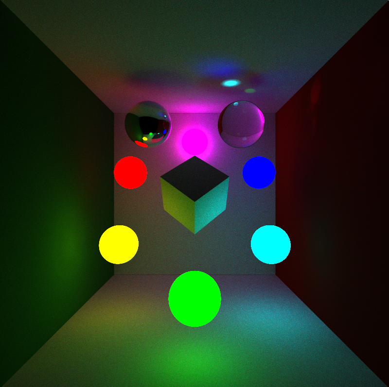
      * The entire scene is lit wit 6 spheres of low emmission and thus near each sphere there is an area of illumination where it's contribution is maximum. This leads to cool effects while the over all colors are still farily representative of the material colors as the light's have been chosen to add up in a complementary manner to white. Notice the cool fresnel reflections and the caustsics of the lights from the sphere on the top right.
   * A variant with the emmisive spheres also being refractive:
      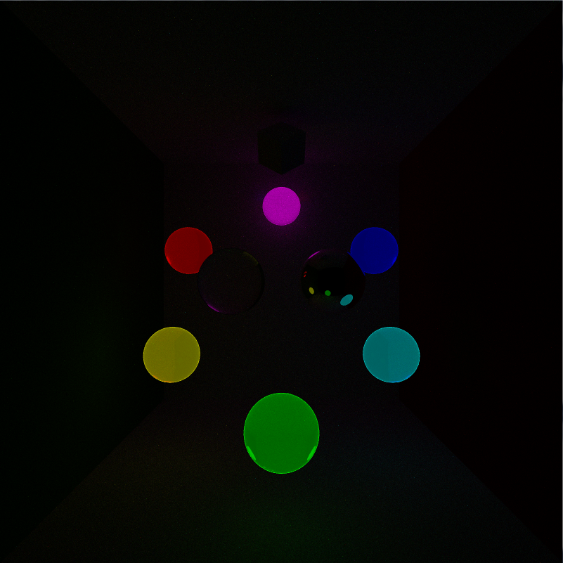
    * Many Spheres: 
      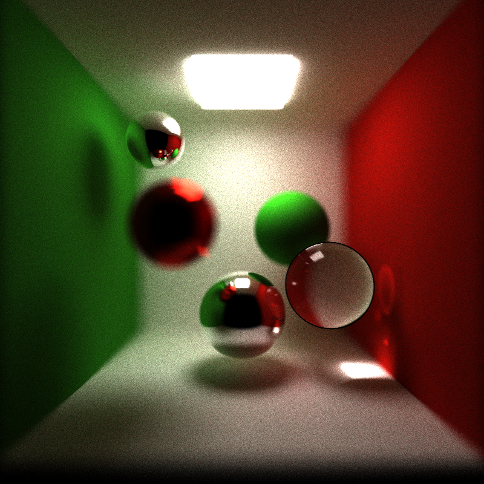
      * This image showcases all the features of the path tracer using a number of spheres. There is a shallow depth of field to focus on the spheres at mid-depth. The multiple caustics arising from not just the light source but the reflections of it as well are a really interesting feature.
    

* Diffuse Shading
   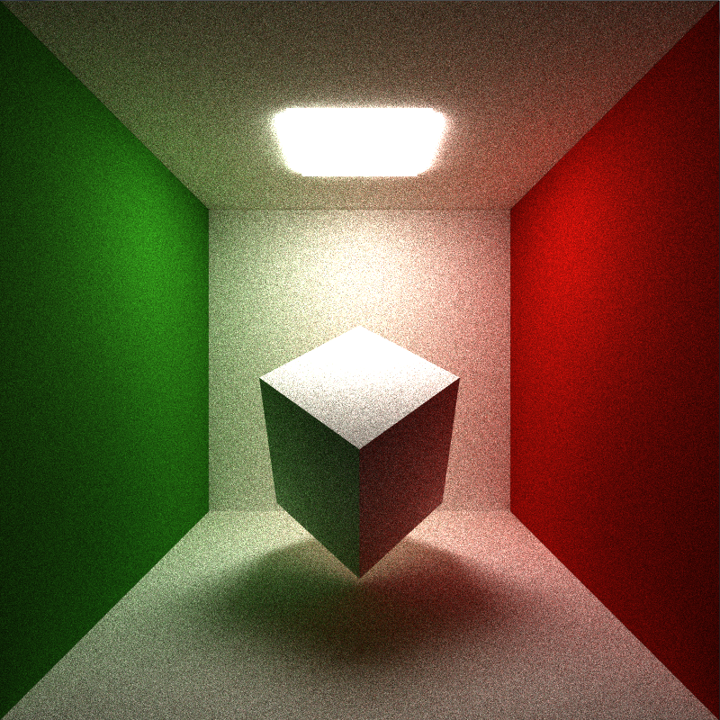

* Specular Shading
   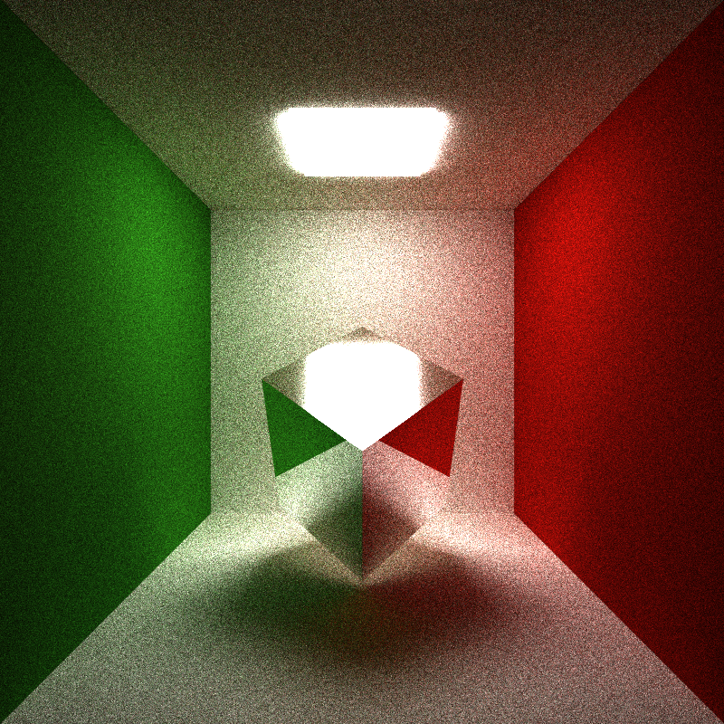

* Refractive Shading
   

* Fresnel Refraction
   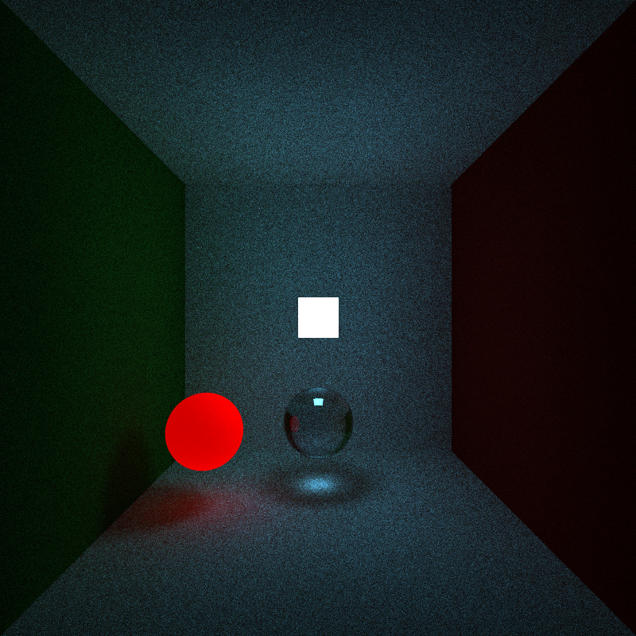

* Fresnel Refraction with Schlick's approximation (Note: There's a small error with the Total internal reflection part of this one which shows up as a black outline on the sphere)
   

* Painterly Mode
   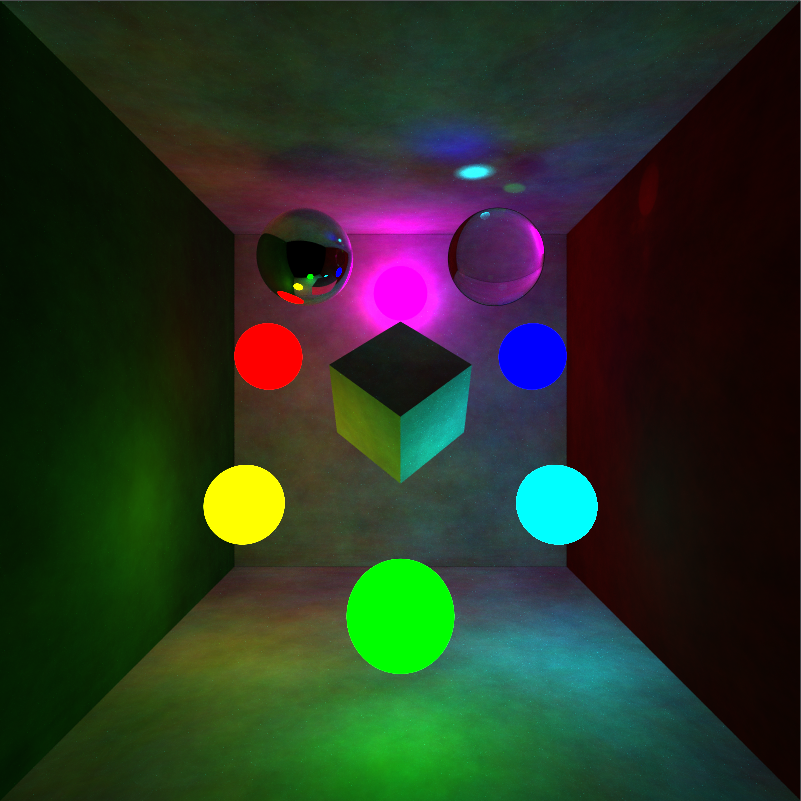

-------------------------------------------------------------------------------
PRE-EXISTING FEATURES:
-------------------------------------------------------------------------------
* Bounce Parallel Execution
* Specular Reflection
* Soft shadows and Area Lights
* Depth of Field
* Super Sampled Anti aliasing
* Refraction (albeit not working correctly)
* Interactive camera
    * wasdqz for X-Y-Z motion
    * [ ] o p for panning camera
    * up down arrow keys for changing distance of focus plane
    * left right arrow keys for increasing and decreasing the aperture

-------------------------------------------------------------------------------
MORE FEATURES:
-------------------------------------------------------------------------------
The extra features added for this assigment are
* Stream Compaction (My own implementation)
* Fresnel Reflection with Schlick's approximation
* Painterly Mode

-------------------------------------------------------------------------------
OBSERVATIONS:
-------------------------------------------------------------------------------
Lets take a look at the effects of stream compcation on the visuals:
No Compaction

   
With Compaction

The stream compaction strengthens the fresnel reflection visible in the top right sphere. I think this happens because of the "dead" rays not being added at all whatsoever where as in without stream compaction, they would still have had a minute contribution. I'm not sure that's entirely correct though.

Also, here, I noticed that if I let the code run for 5000 iterations, I started accumulating artifacts. I suspect this is because during the multiplication for the seed of the random number generator, I must have stepped on an upper limit and the bounces for a large iteration all those beyond it would give the same (diffuse) reflected direction. Thus, the artifacts would "add up" into discernable shapes.

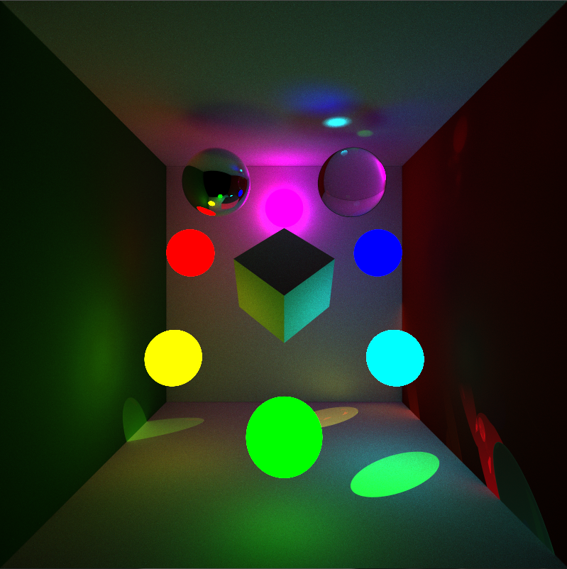

An error I encountered early on was for the same seed, I had not been multiplying the same seed with the bounce depth. Thus effectively, all my bounces were in the same direction relative to the local space of the point of intersection. This was leading to light leaks and bright streaks.
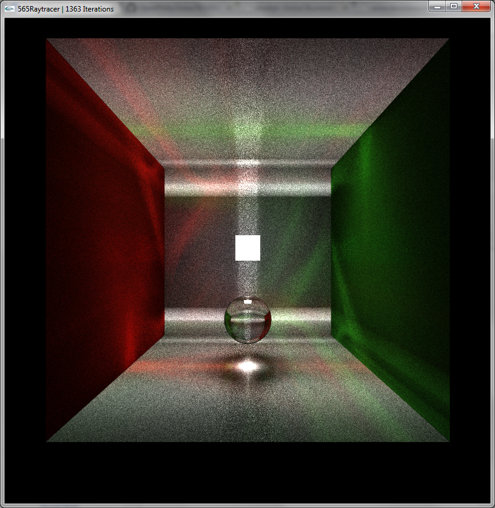
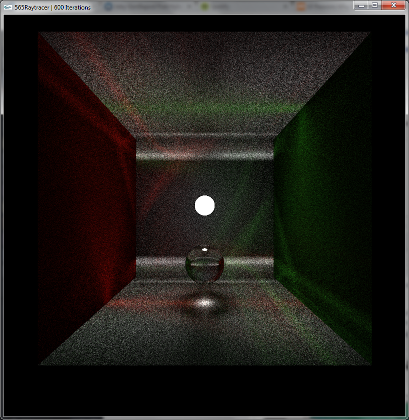
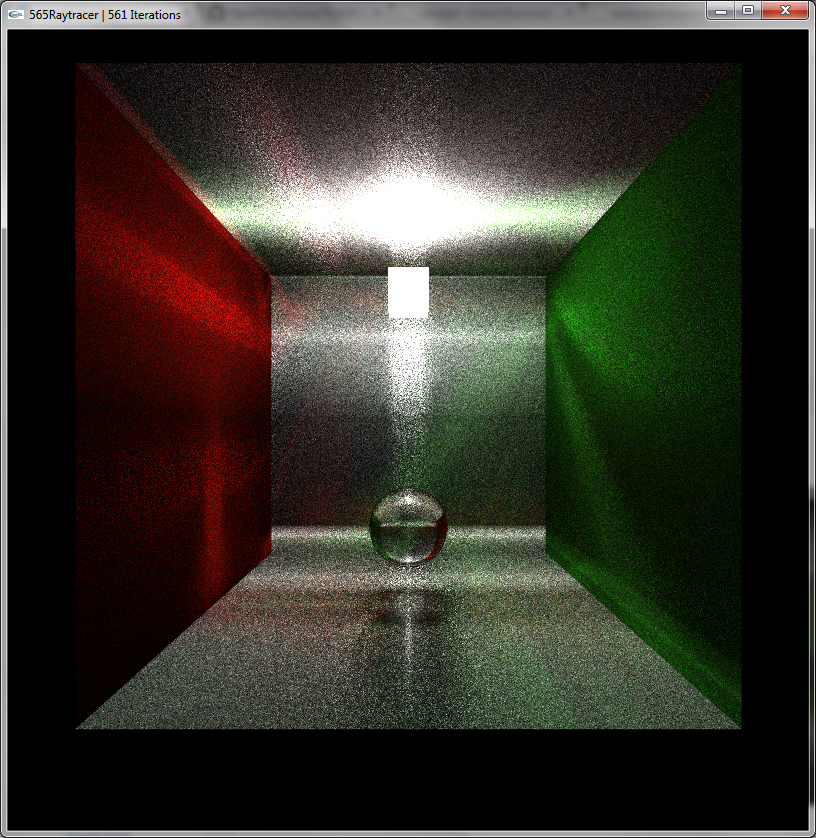

Thus, I tried playing around with the seed and realized that upon giving it a constant value, it appeared that the light and all reflections of it seemed to be projected on to all the surfaces.
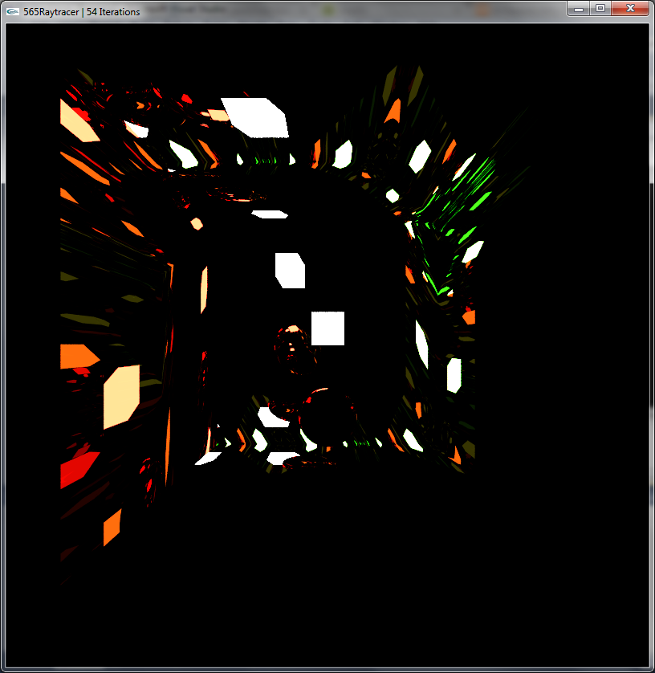

This when let run for a large number of iterations adds up to a very interesting effect where it looks like the scene has been painted with brush strokes yet has correct global illumination properties (soft shadows, color bleeds and caustics). This looked really cool to me so I decided to support it as a "feature" in the code and can be switched on and off!
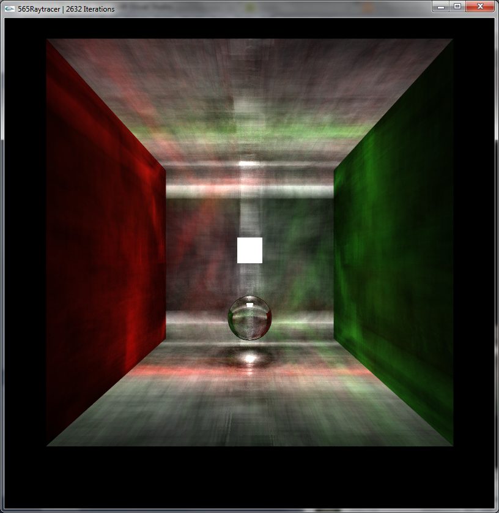
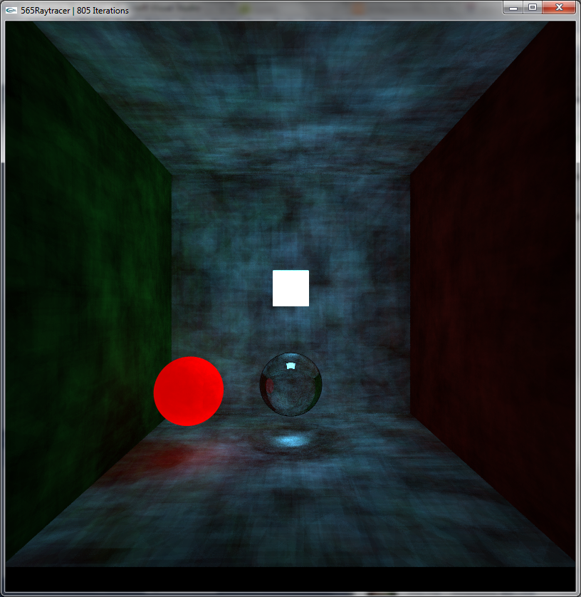

-------------------------------------------------------------------------------
PERFORMANCE ANALYSIS:
-------------------------------------------------------------------------------
For performance, I tried two things:
* Stream Compaction: I wanted to see the effects of stream compaction and so the scene has one of the 6 faces of the room empty (behind the camera). I tested stream compaction on two scenes: The glowing spheres scene and the scene with all my features working on multiple spheres. The graphs below plot the average render time per frame vs the number of bounces. It is easy to see that for a small bounce depth the over head of stream compaction is not worth it. Nonetheless, that overhead becomes extremely small compared to the wasted rays being bounced around for a relatively small bounce depth itself! And on the higher side of things, you can see an almost 20x speed up for 10,000 bounce depths.
   * 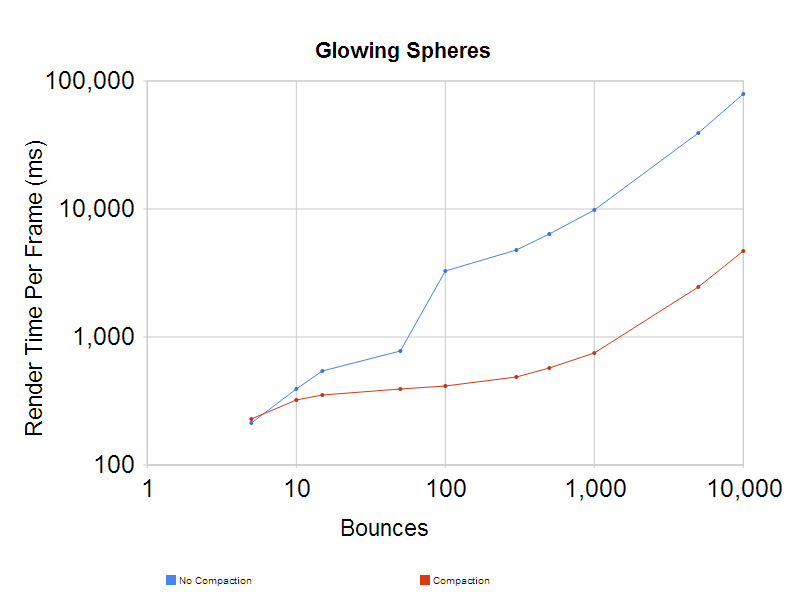
   * 
* Global Memory usage: I had written a lot of my code without storing data from global into local registers and so each time this data was read, it would invoke a global memory call. I removed as many of these as I could and I expected to see a dramatic drop in the run time but there wasn't any noticeable difference. I speculate the NVidia CUDA compiler is smart enough to do these replacements at compilation time itself thus making this exercise futile for the speed up I was hoping to gain but helps decrypt the CUDA compiler a little bit.

-------------------------------------------------------------------------------
THIRD PARTY CODE POLICY
-------------------------------------------------------------------------------
There exists a shared memory scan function taken from Ch 39 of GPU Gems but it has not been connected into the code. I wanted to use it as a base for understanding the shared memory stream compaction but ended up using my own function based on a naive shared scan instead.

-------------------------------------------------------------------------------
SUBMISSION
-------------------------------------------------------------------------------
As with the previous project, you should fork this project and work inside of your fork. Upon completion, commit your finished project back to your fork, and make a pull request to the master repository.
You should include a README.md file in the root directory detailing the following

* A brief description of the project and specific features you implemented
* At least one screenshot of your project running, and at least one screenshot of the final rendered output of your pathtracer
* Instructions for building and running your project if they differ from the base code
* A link to your blog post detailing the project
* A list of all third-party code used
